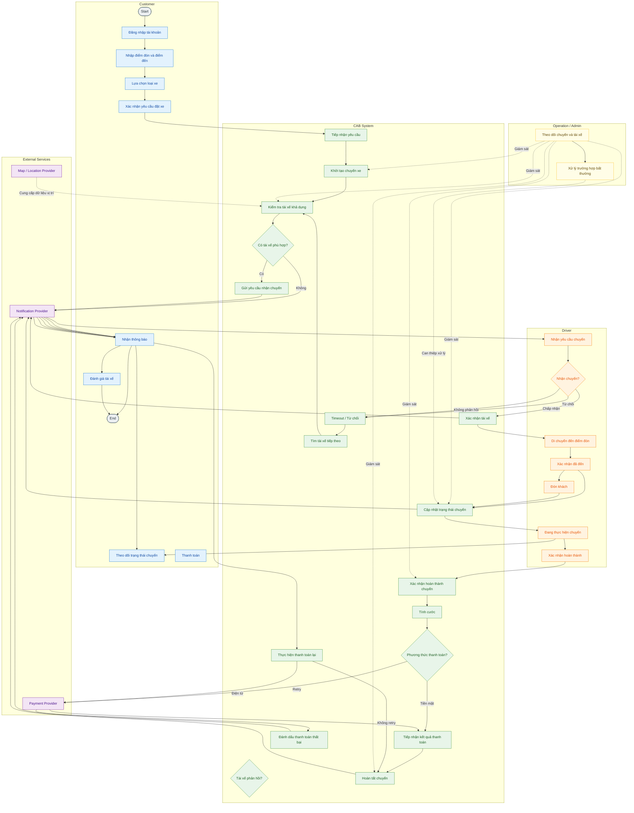
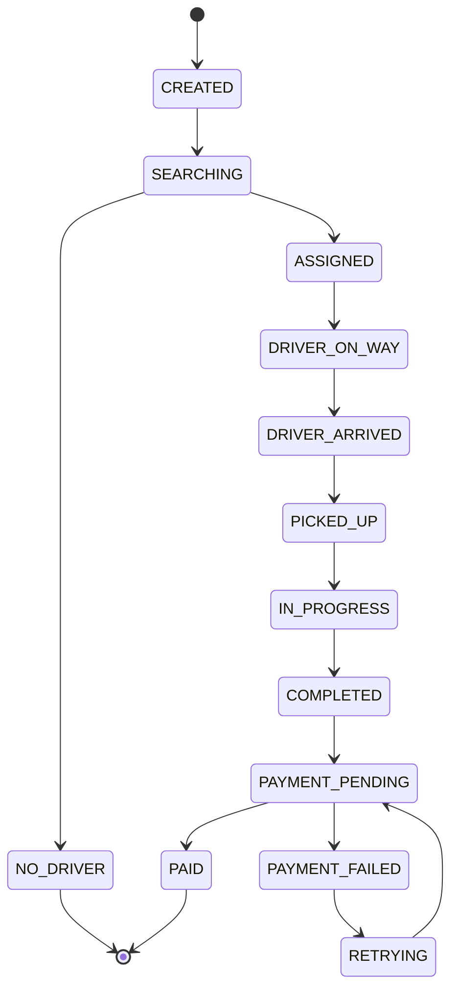

## Bước 1 — Business Context & Business Problem 

### 1. Business Context

Câu 1: xác định business context và business problem

1. Business Context
ABC đang có nhu cầu chuyển đổi hoạt động đặt xe sang một nền tảng số có khả năng kết nối trực tiếp giữa khách hàng – tài xế – bộ phận vận hành. Hệ thống CAB sẽ đóng vai trò là nền tảng quản lý tập trung, hỗ trợ xuyên suốt từ lúc khách hàng tạo yêu cầu đến khi chuyến xe kết thúc, thanh toán và đánh giá.

Ngoài các nhóm người dùng chính, CAB còn cần kết nối với một số dịch vụ bên ngoài như bản đồ/vị trí, cổng thanh toán và các nhà cung cấp thông báo. Điều này giúp hệ thống không phải tự xây dựng tất cả thành phần mà vẫn có thể cung cấp đầy đủ dịch vụ cho người dùng.

Về định hướng kinh doanh, ABC mong muốn giảm sự phụ thuộc vào điều phối thủ công, rút ngắn thời gian xử lý yêu cầu đặt xe, sử dụng tài xế hiệu quả hơn và cung cấp cho khách hàng thông tin rõ ràng về tình trạng chuyến đi. Đồng thời, nền tảng cần được thiết kế với khả năng mở rộng để ABC có thể phát triển thêm dịch vụ trong tương lai.

Một số chính sách nghiệp vụ hiện vẫn chưa được xác định cụ thể, chẳng hạn như cách tính giá, nguyên tắc lựa chọn tài xế, thời gian chờ phản hồi, chính sách hủy, xử lý thanh toán thất bại và thời gian lưu trữ dữ liệu. Đây là những nội dung BA cần làm rõ với các stakeholder trước khi chốt giải pháp.

### 2. Business Problem
Vấn đề chính của ABC không chỉ nằm ở việc thiếu một ứng dụng đặt xe mới, mà là quy trình vận hành hiện tại chưa được số hóa và liên kết thành một luồng thống nhất.

Việc phân tài xế còn phụ thuộc vào nhân viên vận hành khiến khả năng xử lý nhiều yêu cầu cùng lúc bị hạn chế. Khách hàng cũng chưa có đủ thông tin để chủ động theo dõi chuyến xe, trong khi dữ liệu về chuyến đi, thanh toán và hoạt động của tài xế chưa được quản lý tập trung. Khi xảy ra các tình huống bất thường, nhân viên vận hành phải mất nhiều thời gian để kiểm tra và xử lý.

Bên cạnh đó, hệ thống hiện tại chưa tạo được nền tảng tốt cho việc mở rộng quy mô. Khi số lượng khách hàng, tài xế hoặc chuyến xe tăng lên, các quy trình thủ công có thể trở thành điểm nghẽn. Việc bổ sung phương thức thanh toán, dịch vụ mới hoặc kênh thông báo mới cũng có nguy cơ ảnh hưởng đến các chức năng đang hoạt động.

Vì vậy, ABC cần giải quyết bài toán ở cấp độ nền tảng, thay vì chỉ xây dựng một ứng dụng đặt xe. CAB cần giúp doanh nghiệp tự động hóa các hoạt động cốt lõi, tăng khả năng quan sát và kiểm soát vận hành, đồng thời tạo một kiến trúc đủ linh hoạt để tiếp tục phát triển trong những giai đoạn sau.

## Bước 2 — Stakeholder 

# Stakeholder

Stakeholder của dự án CAB được phân loại dựa trên vai trò, mức độ ảnh hưởng đến dự án và mức độ tham gia vào quá trình xây dựng hệ thống.

## 1. Project & Business Stakeholders

- Ban Giám đốc / Project Sponsor
- Finance / Accounting

## 2. Operational Stakeholders

- Operation Staff
- Customer Support
- Admin

## 3. Primary Users

- Customer
- Driver

## 4. Technology & Governance Stakeholders

- IT / Technical Team
- Security / Compliance

## 5. External Partners

- Payment Provider
- Notification Provider
- Map / Location Provider
- Other External Service Providers

---

## Stakeholder Matrix

| Stakeholder | Influence | Interest | Priority | Engagement |
|---|---|---|---|---|
| Ban Giám đốc / Project Sponsor | Cao | Cao | P1 | Tham gia quyết định và review các vấn đề quan trọng |
| Operation Staff | Cao | Cao | P1 | Tham gia phân tích và xác nhận quy trình nghiệp vụ |
| IT / Technical Team | Cao | Cao | P1 | Phối hợp về giải pháp, tích hợp và giới hạn kỹ thuật |
| Security / Compliance | Cao | Cao | P1 | Xác nhận yêu cầu về bảo mật, quyền truy cập và dữ liệu |
| Customer | Thấp | Cao | P1 | Thu thập nhu cầu và phản hồi về trải nghiệm |
| Driver | Trung bình | Cao | P1 | Xác nhận quy trình nhận và thực hiện chuyến |
| Finance / Accounting | Cao | Trung bình | P2 | Tham vấn về tính cước, thanh toán và đối soát |
| Customer Support | Trung bình | Cao | P2 | Xác nhận quy trình hỗ trợ và xử lý ngoại lệ |
| Admin | Trung bình | Trung bình | P2 | Xác nhận chức năng quản trị và phân quyền |
| Payment Provider | Trung bình | Trung bình | P2 | Phối hợp về tích hợp thanh toán và xử lý lỗi |
| Map / Location Provider | Trung bình | Trung bình | P2 | Phối hợp về bản đồ và dữ liệu vị trí |
| Notification Provider | Thấp | Trung bình | P3 | Theo dõi và phối hợp khi có vấn đề tích hợp |
| Other External Service Providers | Thấp | Thấp | P3 | Theo dõi dependency và phối hợp khi cần |

---

## Influence–Interest Matrix

| | Interest thấp | Interest cao |
|---|---|---|
| Influence cao | Finance / Accounting | Ban Giám đốc / Project Sponsor Operation Staff IT / Technical Team Security / Compliance |
| Influence thấp | Admin Notification Provider Other External Service Providers | Customer Driver Customer Support Map / Location Provider |

---

## Stakeholder Engagement Strategy

- **Influence cao – Interest cao:** Làm việc thường xuyên, tham gia workshop, review requirement và đưa ra quyết định khi cần.
- **Influence cao – Interest thấp:** Cập nhật những vấn đề có ảnh hưởng trực tiếp đến phạm vi hoặc hoạt động của stakeholder.
- **Influence thấp – Interest cao:** Chủ động thu thập nhu cầu, phản hồi và thông tin từ người sử dụng hệ thống.
- **Influence thấp – Interest thấp:** Theo dõi ở mức phù hợp và phối hợp khi phát sinh vấn đề liên quan.
  

## Bước 3 — Business Goal 

| Mã | Business Goal | Mô tả |
|---|---|---|
| **BG1** | **Chuyển đổi quy trình đặt xe sang môi trường số** | Đưa các hoạt động từ tiếp nhận yêu cầu, lựa chọn xe, tìm tài xế đến hoàn tất chuyến lên một nền tảng thống nhất, qua đó giảm sự phụ thuộc vào tổng đài và các thao tác điều phối thủ công. |
| **BG2** | **Nâng cao hiệu quả kết nối khách hàng và tài xế** | Rút ngắn thời gian tìm kiếm tài xế và tăng khả năng phục vụ yêu cầu đặt xe bằng cách lựa chọn tài xế dựa trên vị trí, trạng thái hoạt động và các điều kiện vận hành phù hợp. |
| **BG3** | **Mang lại trải nghiệm dịch vụ minh bạch và thuận tiện** | Giúp khách hàng chủ động nắm được tình trạng yêu cầu và chuyến đi, thông tin tài xế, chi phí phải trả và kết quả thanh toán; đồng thời tạo điều kiện để tài xế tiếp nhận và cập nhật chuyến một cách thuận tiện. |
| **BG4** | **Tăng cường khả năng quản lý hoạt động kinh doanh** | Tập trung dữ liệu về khách hàng, tài xế, phương tiện, chuyến xe và giao dịch trên một hệ thống, giúp bộ phận vận hành dễ dàng giám sát, xử lý tình huống bất thường và hỗ trợ ban lãnh đạo theo dõi hiệu quả kinh doanh. |
| **BG5** | **Đảm bảo hoạt động ổn định khi nhu cầu tăng** | Xây dựng hệ thống có khả năng đáp ứng sự gia tăng về số lượng người dùng và chuyến xe, đồng thời hạn chế việc sự cố tại một chức năng như thanh toán hoặc thông báo ảnh hưởng đến hoạt động đặt xe. |
| **BG6** | **Tạo tiền đề cho việc mở rộng dịch vụ** | Xây dựng nền tảng đủ linh hoạt để ABC có thể bổ sung loại hình dịch vụ, phương thức thanh toán, nhà cung cấp bên ngoài hoặc các tính năng mới mà không phải thay đổi toàn bộ hệ thống hiện có. |
| **BG7** | **Tăng cường bảo vệ thông tin và kiểm soát hoạt động** | Đảm bảo thông tin khách hàng, tài xế, phương tiện, vị trí và giao dịch được bảo vệ phù hợp; đồng thời kiểm soát quyền thực hiện các chức năng quản trị và lưu lại các hoạt động quan trọng để phục vụ kiểm tra khi cần. |
| **BG8** | **Hỗ trợ doanh nghiệp ra quyết định dựa trên dữ liệu** | Cung cấp thông tin và báo cáo về tình hình đặt xe, doanh thu, tỷ lệ hoàn thành hoặc hủy chuyến và hiệu quả hoạt động của tài xế, giúp doanh nghiệp đánh giá tình hình và đưa ra quyết định phù hợp. |

## Bước 4 — Project Scope
### 4.1 In-Scope (MVP)

#### A. Customer Management

- Tạo tài khoản và đăng nhập hệ thống
- Quản lý các thông tin cá nhân cần thiết
- Cung cấp thông tin điểm đón, điểm trả và nhu cầu về loại xe
- Khởi tạo và gửi yêu cầu chuyến đi
- Kiểm tra tình trạng chuyến trong từng giai đoạn
- Xem lại các chuyến đã thực hiện và chi phí tương ứng
- Gửi đánh giá cơ bản đối với tài xế sau khi chuyến kết thúc

#### B. Driver Management

- Tạo tài khoản tài xế thông qua đăng ký hoặc bởi nhân viên vận hành
- Quản lý thông tin cá nhân và phương tiện
- Thiết lập trạng thái hoạt động khi muốn nhận chuyến
- Tiếp nhận yêu cầu chuyến và lựa chọn nhận hoặc bỏ qua
- Cập nhật tiến trình thực hiện chuyến theo từng trạng thái
- Cung cấp thông tin vị trí phục vụ hoạt động điều phối tài xế

#### C. Trip & Driver Assignment

- Tiếp nhận yêu cầu và xác định nhóm tài xế có khả năng phục vụ
- Ưu tiên tài xế dựa trên vị trí và trạng thái hiện tại
- Chuyển yêu cầu sang tài xế khác khi tài xế được đề xuất không phản hồi hoặc từ chối
- Cập nhật kết quả tìm tài xế cho khách hàng
- Kết thúc quy trình tìm kiếm khi không còn tài xế phù hợp

#### D. Fare & Payment

- Xác định chi phí chuyến dựa trên loại dịch vụ và thông tin chuyến đi
- Hỗ trợ thanh toán trực tiếp bằng tiền mặt
- Kết nối với một đơn vị thanh toán bên ngoài cho giao dịch điện tử
- Không lưu thông tin nhạy cảm của thẻ hoặc tài khoản thanh toán tại CAB
- Ghi nhận kết quả giao dịch và thông báo cho khách hàng
- Cho phép thực hiện lại giao dịch thất bại theo chính sách được xác định

#### E. Notification

- Gửi thông tin đến khách hàng khi yêu cầu được tiếp nhận, tài xế được phân công, tài xế đến điểm đón, chuyến hoàn tất và thanh toán có kết quả
- Gửi thông báo cho tài xế khi có yêu cầu mới hoặc có thay đổi liên quan đến chuyến
- MVP triển khai một phương thức thông báo chính
- Thiết kế cơ chế tích hợp để có thể bổ sung thêm các phương thức khác trong tương lai

#### F. Operation & Administration

- Theo dõi các chuyến đang hoạt động
- Kiểm tra tình trạng và thông tin cơ bản của tài xế
- Tra cứu thông tin chuyến và giao dịch
- Hỗ trợ nhân viên xử lý thủ công các trường hợp chuyến gặp sự cố
- Phân biệt quyền hạn giữa Admin và nhân viên vận hành
- Quản lý các đối tượng chính như khách hàng, tài xế và phương tiện trong phạm vi MVP

#### G. Security & System Reliability

- Xác thực người dùng trước khi truy cập các chức năng yêu cầu tài khoản
- Giới hạn chức năng quản trị dựa trên quyền được cấp
- Ghi nhận các hoạt động quan trọng để phục vụ kiểm tra khi có sự cố
- Tách biệt các thành phần tích hợp để sự cố của payment hoặc notification không làm gián đoạn toàn bộ quy trình đặt xe

---

### 4.2 Out-of-Scope

Các nội dung sau chưa được đưa vào phiên bản MVP và có thể xem xét ở các giai đoạn tiếp theo:

- Hệ thống báo cáo chuyên sâu và dashboard phân tích kinh doanh
- Hỗ trợ đồng thời nhiều phương thức thanh toán điện tử
- Lưu sẵn nhiều phương thức thanh toán của khách hàng
- Triển khai nhiều kênh notification cùng lúc
- Cơ chế matching tài xế sử dụng AI/ML hoặc các thuật toán tối ưu nâng cao
- Dynamic pricing hoặc surge pricing
- Các dịch vụ ngoài đặt xe thông thường như giao hàng, xe ghép hoặc đặt xe theo lịch
- Hệ thống loyalty, voucher, khuyến mãi và chương trình khách hàng thân thiết
- Theo dõi vị trí nâng cao và cơ chế dự đoán ETA có độ chính xác cao
- Quy trình hủy chuyến phức tạp và cơ chế tính phí phạt tự động
- Kết nối đồng thời với nhiều Payment Provider
- Kết nối đồng thời với nhiều Notification Provider
- Kết nối đồng thời với nhiều Map / Location Provider
- Hệ thống BI và phân tích hiệu suất tài xế chuyên sâu
- Các tính năng tự động hóa vận hành nâng cao chưa cần thiết cho MVP

## Bước 5 — Business Requirement
## Business Requirement

> **Business Requirement** xác định những khả năng mà doanh nghiệp mong muốn hệ thống cung cấp để đáp ứng mục tiêu kinh doanh. Các yêu cầu được mô tả ở mức nghiệp vụ, chưa đi vào thiết kế giao diện hoặc chi tiết xử lý kỹ thuật.

| Mã | Business Requirement | Liên kết Business Goal | Nhóm |
|---|---|---|---|
| BR-01 | Khách hàng có thể chủ động tạo tài khoản và gửi yêu cầu đặt xe trực tiếp trên CAB mà không cần liên hệ với tổng đài | BG1 | Booking |
| BR-02 | CAB có khả năng tự xác định và lựa chọn tài xế đáp ứng điều kiện phục vụ dựa trên vị trí và trạng thái hoạt động | BG2 | Driver Matching |
| BR-03 | Khi tài xế được lựa chọn không tiếp nhận yêu cầu trong thời gian quy định hoặc từ chối chuyến, hệ thống tiếp tục tìm phương án thay thế mà không yêu cầu khách hàng đặt lại | BG2 | Driver Matching |
| BR-04 | Khách hàng có thể biết được tiến trình của chuyến xe từ lúc tạo yêu cầu cho đến khi chuyến kết thúc | BG3 | Trip Tracking |
| BR-05 | CAB xác định số tiền cần thanh toán dựa trên thông tin dịch vụ và dữ liệu thực tế của chuyến đi | BG5 | Fare |
| BR-06 | Hệ thống hỗ trợ thanh toán trực tiếp và thanh toán thông qua ít nhất một đối tác thanh toán điện tử | BG5 | Payment |
| BR-07 | Thông tin xác thực thanh toán nhạy cảm phải được xử lý thông qua đối tác thanh toán và không được lưu trực tiếp trong CAB | BG8 | Payment & Security |
| BR-08 | CAB cung cấp cơ chế thông báo cho khách hàng và tài xế khi xảy ra các sự kiện quan trọng trong quá trình đặt và thực hiện chuyến | BG3 | Notification |
| BR-09 | Nhân viên vận hành có thể theo dõi các chuyến đang hoạt động và can thiệp để xử lý những trường hợp không thể giải quyết tự động | BG4 | Operation |
| BR-10 | Quyền sử dụng các chức năng quản trị được kiểm soát theo vai trò, đặc biệt đối với những thao tác có ảnh hưởng đến dữ liệu hoặc hoạt động kinh doanh | BG8 | Access Control |
| BR-11 | Các sự kiện và thao tác có tính chất quan trọng phải được ghi nhận để phục vụ việc kiểm tra và truy nguyên khi xảy ra vấn đề | BG8 | Audit |
| BR-12 | Hệ thống cần được tổ chức để sự cố tại một dịch vụ như thanh toán hoặc thông báo không làm ngừng toàn bộ hoạt động đặt xe | BG6 | Reliability |
| BR-13 | Nền tảng cần hỗ trợ việc thay thế hoặc bổ sung các đối tác bên ngoài như Payment, Notification và Map/Location mà không ảnh hưởng lớn đến các chức năng nghiệp vụ hiện có | BG7 | Extensibility |

## Bước 6 - Business Process

## Bước 7 - Functional Requirement
# 7. Functional Requirements

Functional Requirement (FR) mô tả các chức năng mà hệ thống CAB cần cung cấp để đáp ứng Business Requirement. Các yêu cầu dưới đây tập trung vào hành vi của hệ thống, actor thực hiện và mức độ ưu tiên trong phạm vi MVP.

## 7.1 Account & Authentication

| ID | Functional Requirement | Actor | Priority |
|---|---|---|---|
| FR-001 | Customer có thể tạo tài khoản bằng thông tin đăng ký được ABC quy định. | Customer | Must |
| FR-002 | Customer, Driver và nhân viên quản trị có thể đăng nhập bằng thông tin xác thực hợp lệ. | Customer / Driver / Admin | Must |
| FR-003 | Hệ thống kiểm tra thông tin xác thực trước khi cho phép truy cập chức năng yêu cầu đăng nhập. | System | Must |
| FR-004 | Customer có thể chỉnh sửa các thông tin cá nhân cơ bản. | Customer | Must |
| FR-005 | Driver có thể cập nhật thông tin cá nhân và thông tin phương tiện trong phạm vi quyền hạn. | Driver | Must |
| FR-006 | Operation Staff có thể cập nhật hồ sơ Driver theo quyền được cấp. | Operation | Must |
| FR-007 | Hệ thống xác định role của người dùng sau khi đăng nhập. | System | Must |
| FR-008 | Hệ thống chặn người dùng truy cập các chức năng không thuộc quyền của mình. | System | Must |

## 7.2 Booking

| ID | Functional Requirement | Actor | Priority |
|---|---|---|---|
| FR-009 | Customer có thể nhập vị trí đón và vị trí cần đến. | Customer | Must |
| FR-010 | Customer có thể chọn loại xe/dịch vụ trước khi gửi yêu cầu. | Customer | Must |
| FR-011 | Hệ thống kiểm tra dữ liệu bắt buộc trước khi tiếp nhận booking. | System | Must |
| FR-012 | Hệ thống tạo một booking mới sau khi yêu cầu hợp lệ được gửi đi. | System | Must |
| FR-013 | Mỗi booking được cấp một mã định danh riêng. | System | Must |
| FR-014 | Booking lưu các thông tin chính gồm Customer, thời gian tạo, điểm đón, điểm đến và loại xe. | System | Must |
| FR-015 | Hệ thống thông báo cho Customer khi booking được tiếp nhận thành công. | System | Must |
| FR-016 | Customer có thể xem trạng thái hiện tại của booking. | Customer | Must |
| FR-017 | Hệ thống từ chối booking nếu dữ liệu không đáp ứng các business rule đã cấu hình. | System | Must |

## 7.3 Driver Matching

| ID | Functional Requirement | Actor | Priority |
|---|---|---|---|
| FR-018 | Hệ thống xác định các Driver đang ở trạng thái có thể nhận chuyến. | System | Must |
| FR-019 | Hệ thống sử dụng dữ liệu vị trí để lựa chọn nhóm Driver phù hợp. | System | Must |
| FR-020 | Hệ thống gửi lời mời nhận chuyến đến Driver được lựa chọn. | System | Must |
| FR-021 | Hệ thống ghi nhận kết quả phản hồi của Driver. | System | Must |
| FR-022 | Nếu Driver không phản hồi trong thời gian quy định, yêu cầu được xem là hết thời gian chờ. | System | Must |
| FR-023 | Khi Driver từ chối hoặc hết thời gian phản hồi, hệ thống tiếp tục tìm Driver khác. | System | Must |
| FR-024 | Một Driver đã từ chối booking không được tiếp tục nhận cùng booking trong cùng vòng matching. | System | Must |
| FR-025 | Hệ thống đảm bảo chỉ một Driver được xác nhận cho một booking tại cùng thời điểm. | System | Must |
| FR-026 | Khi matching thành công, booking được chuyển sang trạng thái đã phân công Driver. | System | Must |
| FR-027 | Khi không còn Driver phù hợp, booking được chuyển sang trạng thái không tìm thấy Driver. | System | Must |
| FR-028 | Customer nhận được thông báo nếu quá trình matching không tìm được Driver. | System | Must |

## 7.4 Trip & Tracking

| ID | Functional Requirement | Actor | Priority |
|---|---|---|---|
| FR-029 | Hệ thống quản lý trạng thái của chuyến theo từng giai đoạn trong vòng đời chuyến. | System | Must |
| FR-030 | Driver có thể xác nhận đã đến điểm đón. | Driver | Must |
| FR-031 | Driver có thể xác nhận đã đón Customer. | Driver | Must |
| FR-032 | Driver có thể chuyển chuyến sang trạng thái đang thực hiện. | Driver | Must |
| FR-033 | Driver có thể xác nhận hoàn thành chuyến. | Driver | Must |
| FR-034 | Hệ thống kiểm tra trạng thái hiện tại trước khi cho phép chuyển sang trạng thái tiếp theo. | System | Must |
| FR-035 | Customer được cập nhật khi trạng thái chuyến thay đổi. | System | Must |
| FR-036 | Customer có thể theo dõi trạng thái chuyến gần realtime. | Customer | Must |
| FR-037 | Hệ thống tiếp nhận dữ liệu vị trí từ Map/Location Provider để hỗ trợ tracking và matching. | System | Must |
| FR-038 | Hệ thống lưu lại các thay đổi trạng thái quan trọng của chuyến. | System | Must |

## 7.5 Fare Calculation

| ID | Functional Requirement | Actor | Priority |
|---|---|---|---|
| FR-039 | Hệ thống xác định giá chuyến dựa trên loại dịch vụ và dữ liệu chuyến. | System | Must |
| FR-040 | Cước cuối cùng được tính khi Driver hoàn tất chuyến. | System | Must |
| FR-041 | Hệ thống lưu lại số tiền phải thanh toán của booking. | System | Must |
| FR-042 | Customer có thể xem số tiền cần thanh toán. | Customer | Must |
| FR-043 | MVP sử dụng công thức giá cơ bản và chưa áp dụng dynamic/surge pricing. | System | Must |

## 7.6 Payment

| ID | Functional Requirement | Actor | Priority |
|---|---|---|---|
| FR-044 | Customer có thể chọn thanh toán bằng tiền mặt hoặc phương thức điện tử được hỗ trợ. | Customer | Must |
| FR-045 | Với thanh toán điện tử, CAB gửi yêu cầu giao dịch đến Payment Provider. | System | Must |
| FR-046 | Hệ thống tiếp nhận kết quả giao dịch từ Payment Provider. | System | Must |
| FR-047 | Giao dịch được chuyển sang trạng thái thành công khi Provider xác nhận thanh toán thành công. | System | Must |
| FR-048 | Hệ thống ghi nhận kết quả khi giao dịch thất bại. | System | Must |
| FR-049 | Customer nhận được thông báo khi thanh toán điện tử không thành công. | System | Must |
| FR-050 | Customer có thể thực hiện lại thanh toán theo chính sách retry. | Customer | Must |
| FR-051 | Hệ thống đảm bảo một nghĩa vụ thanh toán không bị ghi nhận thành nhiều giao dịch thành công do retry. | System | Must |
| FR-052 | CAB chỉ lưu thông tin tham chiếu cần thiết của giao dịch và không lưu dữ liệu thẻ nhạy cảm. | System | Must |
| FR-053 | Customer có thể xem lại lịch sử thanh toán của mình. | Customer | Must |

## 7.7 Notification

| ID | Functional Requirement | Actor | Priority |
|---|---|---|---|
| FR-054 | Gửi thông báo khi booking được hệ thống tiếp nhận. | System | Must |
| FR-055 | Gửi thông báo cho Customer khi Driver được phân công. | System | Must |
| FR-056 | Thông báo cho Customer khi Driver xác nhận đã đến điểm đón. | System | Must |
| FR-057 | Gửi thông báo khi chuyến được hoàn tất. | System | Must |
| FR-058 | Gửi kết quả thanh toán đến Customer. | System | Must |
| FR-059 | Gửi thông tin chuyến mới đến Driver phù hợp. | System | Must |
| FR-060 | Hệ thống lưu trạng thái gửi thông báo để phục vụ kiểm tra lỗi. | System | Should |
| FR-061 | Module nghiệp vụ không phụ thuộc trực tiếp vào một Notification Provider cụ thể. | System | Must |
| FR-062 | Có thể thay thế hoặc bổ sung Notification Provider mà không phải thay đổi toàn bộ logic nghiệp vụ. | System | Should |

## 7.8 Driver Management

| ID | Functional Requirement | Actor | Priority |
|---|---|---|---|
| FR-063 | Driver có thể bật trạng thái sẵn sàng nhận chuyến khi bắt đầu làm việc. | Driver | Must |
| FR-064 | Driver có thể tắt trạng thái nhận chuyến khi không muốn nhận booking mới. | Driver | Must |
| FR-065 | Chỉ Driver đang sẵn sàng mới được đưa vào quá trình matching. | System | Must |
| FR-066 | Hệ thống lưu trạng thái hoạt động hiện tại của Driver. | System | Must |
| FR-067 | Operation Staff có thể xem danh sách Driver và trạng thái hiện tại. | Operation | Must |
| FR-068 | Hệ thống cập nhật trạng thái Driver theo các sự kiện nhận và thực hiện chuyến. | System | Must |

## 7.9 Operation & Administration

| ID | Functional Requirement | Actor | Priority |
|---|---|---|---|
| FR-069 | Operation Staff có thể xem danh sách các chuyến đang hoạt động. | Operation | Must |
| FR-070 | Hệ thống hiển thị trạng thái hiện tại của từng chuyến trên giao diện quản trị. | System | Must |
| FR-071 | Operation Staff có thể xem Driver đang được phân công cho từng chuyến. | Operation | Must |
| FR-072 | Operation Staff có thể tìm kiếm và tra cứu lịch sử chuyến. | Operation | Must |
| FR-073 | Operation Staff có thể tra cứu thông tin giao dịch phục vụ hỗ trợ khách hàng. | Operation | Must |
| FR-074 | Operation Staff có thể xử lý các trường hợp chuyến gặp lỗi trong phạm vi quyền được cấp. | Operation | Must |
| FR-075 | Hệ thống yêu cầu xác nhận đối với các thao tác quản trị có ảnh hưởng đến dữ liệu/chuyến. | System | Should |
| FR-076 | Admin có thể quản lý quyền của các nhóm nhân viên theo chính sách của doanh nghiệp. | Admin | Must |
| FR-077 | Operation Staff không thể thực hiện các thao tác chỉ dành cho Admin. | System | Must |

## 7.10 Rating

| ID | Functional Requirement | Actor | Priority |
|---|---|---|---|
| FR-078 | Customer có thể đánh giá Driver sau khi chuyến kết thúc. | Customer | Must |
| FR-079 | Rating sử dụng thang điểm do hệ thống cấu hình. | Customer | Must |
| FR-080 | Hệ thống liên kết đánh giá với Customer, Driver và chuyến tương ứng. | System | Must |
| FR-081 | Một chuyến chỉ được Customer đánh giá tối đa một lần. | System | Must |

## 7.11 History & Audit

| ID | Functional Requirement | Actor | Priority |
|---|---|---|---|
| FR-082 | Hệ thống lưu lịch sử các chuyến đã phát sinh của Customer. | System | Must |
| FR-083 | Customer chỉ được xem lịch sử chuyến thuộc tài khoản của mình. | Customer | Must |
| FR-084 | Hệ thống lưu các sự kiện quan trọng trong vòng đời của chuyến. | System | Must |
| FR-085 | Hệ thống tạo audit log cho các thao tác quản trị quan trọng. | System | Must |
| FR-086 | Audit log bao gồm người thực hiện, thời gian, hành động và đối tượng bị tác động. | System | Must |
| FR-087 | Chỉ những role có quyền phù hợp mới được xem audit log. | System | Must |

## 7.12 Trip Status

## 7.13 Requirement Traceability

Business Requirement	Functional Requirement
BR-01	FR-001 → FR-017
BR-02	FR-018 → FR-021, FR-025 → FR-027
BR-03	FR-022 → FR-024
BR-04	FR-029 → FR-038
BR-05	FR-039 → FR-043
BR-06	FR-044 → FR-050
BR-07	FR-051 → FR-052
BR-08	FR-054 → FR-062
BR-09	FR-069 → FR-075
BR-10	FR-007, FR-008, FR-076, FR-077
BR-11	FR-084 → FR-087
BR-12	FR-061 → FR-062
BR-13	FR-061 → FR-062

## 7.14 Open Points cần xác nhận

STT	Nội dung cần làm rõ	Bên xác nhận
1	Hình thức đăng ký Customer: số điện thoại, email hay cả hai?	Business / Product
2	Khoảng cách tối đa để tìm Driver.	Operation
3	Tiêu chí và thứ tự ưu tiên Driver.	Operation
4	Thời gian Driver được phép phản hồi booking.	Operation
5	Số lần hệ thống thực hiện matching lại.	Operation
6	Công thức tính cước chính thức.	Business / Finance
7	Số lần retry thanh toán tối đa.	Finance / Business
8	Tần suất cập nhật vị trí Driver.	Business / Technical
9	Kênh notification được sử dụng trong MVP.	Business
10	Thời gian lưu dữ liệu chuyến, giao dịch và audit log.	Business / Compliance
11	Những thao tác nào Operation được phép override.	Business / Operation
